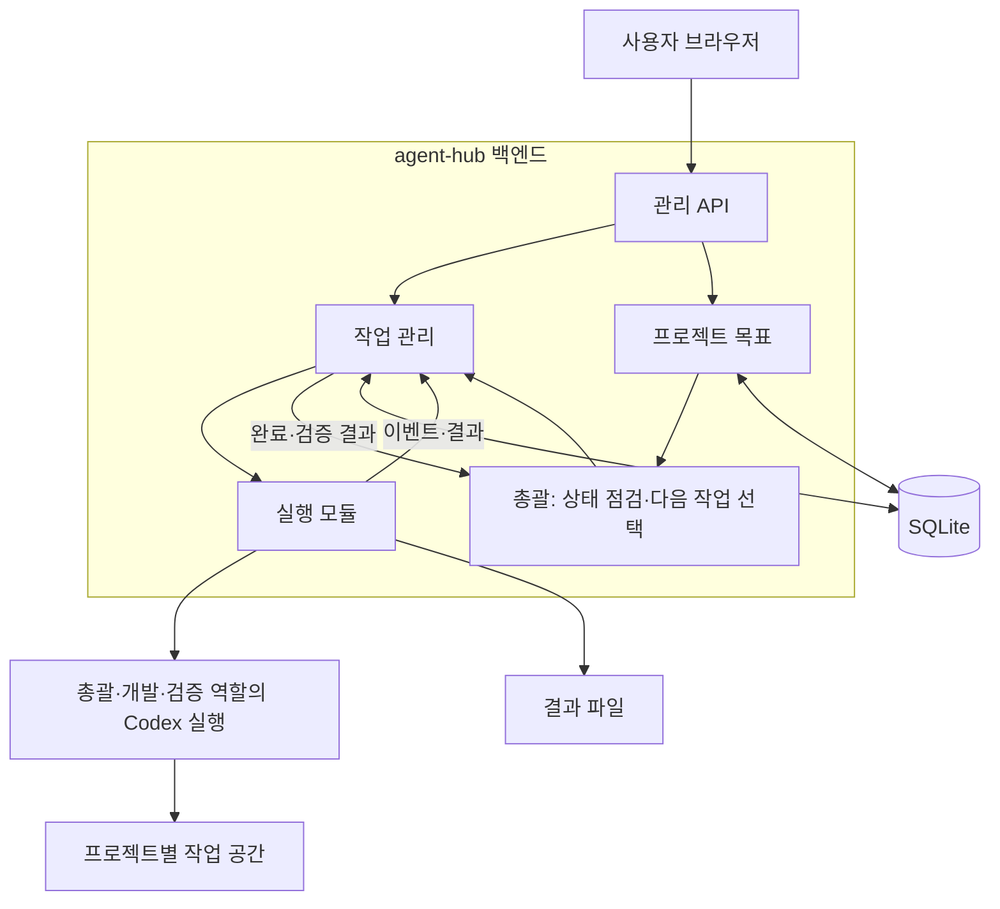

# agent-hub

여러 프로젝트의 목표를 맡기면, AI 에이전트들이 스스로 할 일을 찾고 개발·검증·개선을 이어가는 개인용 프로젝트 관리 시스템입니다.

사용자는 프로젝트별 목표·우선순위·허용 범위를 설정합니다. 총괄은 현재 코드와 작업 이력을 바탕으로 다음 작업을 만들고, 개발·검증 역할의 에이전트가 결과와 피드백을 주고받습니다. 작업이 끝나면 다음 작업을 선택하므로 매번 사용자의 새 지시가 필요하지 않습니다. 사용자는 진행 상황을 확인하고 목표를 바꾸거나 실행을 멈출 수 있습니다.

현재는 **2단계의 실제 AI 연결과 수동 복구를 구현한 상태**입니다. 프로젝트·작업 등록·조회, Codex 읽기 전용 분석, 자동 대기열과 종료 확인 후 재개·취소 API가 동작합니다. 실행 설정을 지정해 서버를 켜면 등록된 작업을 하나씩 분석합니다. 3단계의 단일 사용자 로그인·세션 보호를 추가했고, 관리 화면·서비스 관측을 이어 구현합니다. 자동 복구·자율 작업 생성·배포는 후속 단계입니다.

## 문서를 읽는 순서

| 알고 싶은 내용 | 문서 | 이 문서에서 관리하는 내용 |
| --- | --- | --- |
| 무엇을 만드는가? | 이 README | 목적, 현재 상태, 첫 버전 범위 |
| 어떻게 동작하고 코드를 나누는가? | [01 구조와 작업 실행 규칙](docs/01-architecture.md) | 용어, 코드 연결, 작업 상태, 취소·복구·effort 규칙 |
| 무엇부터 만들고 어떻게 확인하는가? | [02 구현 순서와 완료 기준](docs/02-implementation-plan.md) | 개발 단계, 단계별 목표, 구현 범위와 검증 |
| 왜 이 기술과 구조를 골랐는가? | [03 초기 기술 선택과 대안](docs/03-technology-decisions.md) | 선택 이유, 대안, 단점과 재검토 조건 |

처음 읽을 때는 README를 보고 01의 용어·흐름부터 읽으면 됩니다. 구현할 때는 02에서 현재 단계를 찾고, 관련 동작은 01, 기술 선택은 03을 확인합니다. 요약과 상세 설명이 다르면 구현 전에 관련 문서를 맞춥니다.

AI가 이 저장소를 수정할 때의 문서 참조 순서·개발 방법·검증 기준은 [AGENTS.md](AGENTS.md)에 둡니다. 제품의 상세 규칙은 위 설계 문서에서 관리합니다.

## 첫 번째 목표

> 예제 앱에 “기본 학습 흐름을 완성하고 테스트로 검증해줘”라는 목표를 설정한다. 이후 사용자 입력 없이 미완성 기능을 찾아 작업으로 만들고, 개발·검증·필요한 재작업을 수행한 뒤 다음 작업으로 넘어간다. 관리 화면에서 선택 이유와 변경 결과를 확인할 수 있고, 서버를 재시작해도 이어서 처리한다.

MVP는 핵심 목적을 실제로 수행할 수 있는 첫 운영 버전입니다. 이 프로젝트에서는 02 문서의 6단계까지 완성한 자율 운영 버전을 뜻합니다. 1단계의 등록·조회와 2단계의 읽기 전용 분석은 연결을 검증하는 중간 단계입니다. 5단계에서 자율 작업 생성·개발·검증을 연결하고, 6단계에서 클라우드 무인 운영을 검증합니다.

| 범위 | 첫 버전의 기준 |
| --- | --- |
| 운영 규모 | 사용자 한 명, 서버 한 대, 백엔드 한 개, 동시 실행 Run 한 개. 그 안의 AI 호출은 순차 실행 |
| 프로젝트 작업 | 목표에 따른 작업 자동 생성, 분리된 개발 작업 공간에서 코드 수정·테스트 |
| 에이전트 협업 | 총괄·개발·검증 역할이 기록을 주고받으며 순차 실행. 병렬 실행은 후속 확장 |
| 다음 작업 | 완료·검증 결과와 프로젝트 상태를 반영해 자동 선택. 주기적으로 새 변화도 확인 |
| 변경 결과 | 검증된 변경을 개발용 브랜치에 축적. 외부 푸시·기본 브랜치 병합·운영 배포는 별도 정책 |
| 진행 확인 | 현재 단계, 최근 활동·진척, 대기 사유와 다음 행동 표시 |
| 기존 서비스 관측 | 상태를 읽기만 하고 정상 동작·정상 대기·관측 실패를 구분 |
| 무인 복구 | 사용 한도 대기 후 자동 재개, 일시적 오류의 제한된 재시도 |
| 사용자 조치 | 사용자 취소는 자동 재시도하지 않으며, 인증 만료·복구 한도 초과는 보류·알림 |
| 추론 강도 | 다음 호출마다 `medium`·`high`·`xhigh` 중 선택. 최소·기본값은 `medium` |

24시간 운영의 핵심은 사용자 부재중에도 목표에 맞는 일을 발견하고 수행하는 반복 흐름입니다. 대기열이 비면 목표와 현재 상태를 다시 평가합니다. 할 일이 없거나 실행 예산이 부족하면 이유와 다음 점검 시각을 기록하고, 조건이 충족되면 자동으로 이어갑니다. 유한한 목표는 완료로 닫고, 지속 관리 목표는 정해진 주기로 점검합니다. effort는 단계 난이도에 따라 높이거나 낮추며 실제 지원 범위와 실행 예산은 백엔드가 확인합니다.

작업 관리와 실행은 같은 프로그램 안에서 나눕니다. 코드는 기능별로 모으고, 업무 규칙은 HTTP·DB·AI SDK 사용 코드에서 분리합니다. 단순한 기능에 불필요한 계층을 추가하지 않습니다. 작업 취소와 제한 시간은 해당 AI 실행에만 적용하며, 관측 중인 다른 서비스를 종료하지 않습니다.

## 기술 스택

| 영역 | 선택 | 역할 |
| --- | --- | --- |
| 언어 | TypeScript | 화면·서버·실행 프로그램의 데이터 형식 공유 |
| 관리 화면 | React + Vite | 프로젝트, 작업 목록, 진행 상황, 결과 표시 |
| 총괄 서버 | Node.js + Fastify | 인증, 작업 등록·배정, 상태·결과 저장 |
| 내부 실행 모듈 | Node.js + Codex SDK | 프로젝트 준비, 에이전트 실행, 결과 기록 |
| 데이터 저장 | SQLite | 프로젝트 설정, 작업, 실행 이력, 이벤트 저장 |
| 테스트 | Vitest + Playwright | 상태 전이와 주요 사용자 흐름 검증 |
| 배포 | Docker Compose | 서비스 실행 환경과 재시작해도 데이터가 남는 저장 공간 구성 |

개발 환경은 Node.js 24 LTS와 pnpm을 사용합니다. SQLite는 better-sqlite3와 Drizzle ORM·Kit으로 연결합니다. 의존성은 `package.json`과 `pnpm-lock.yaml`에 고정했습니다. 초기 SQLite 기반은 macOS arm64·Linux arm64에서, 현재 Codex 연동은 macOS arm64에서 검증했습니다. [대안 비교와 선택 이유](docs/03-technology-decisions.md)를 기록합니다.

## 로컬 실행

저장소 루트에서 실행합니다. Node.js는 [`.nvmrc`](.nvmrc)의 24.22.1, pnpm은 [`package.json`](package.json)의 12.16.1을 준비합니다. [nvm](https://github.com/nvm-sh/nvm)을 사용한다면 다음과 같이 맞출 수 있습니다.

```sh
nvm install
nvm use
npm install --global pnpm@12.16.1
```

의존성을 설치하고 개발 서버를 실행합니다. `pnpm dev`는 소스가 바뀌면 서버를 다시 시작합니다.

```sh
pnpm install --frozen-lockfile
LOCAL_API_ONLY=1 pnpm dev
```

다른 터미널에서 응답을 확인합니다.

```sh
curl http://127.0.0.1:3000/health/live
curl http://127.0.0.1:3000/health/ready
```

위 명령은 인증 없는 로컬 API 개발 모드를 명시적으로 켭니다. 이 README의 curl 예제는 이 모드를 기준으로 합니다. 로그인 기능을 사용할 때는 아래 `AUTH_CONFIG` 방식으로 실행하며, `/health/live` 외 데이터 API에는 로그인 세션이 필요합니다. 둘 중 하나를 정하지 않은 서버는 시작하지 않습니다.

서버 응답 확인(`/health/live`) 예시:

```json
{"status":"ok","checkedAt":"2026-10-29T00:00:00.000Z"}
```

DB 준비 상태(`/health/ready`) 예시:

```json
{"status":"ok","database":"ok","checkedAt":"2026-10-29T00:00:00.000Z"}
```

| API | 확인하는 범위 |
| --- | --- |
| `/health/live` | 서버가 HTTP 요청에 응답하는지 확인 |
| `/health/ready` | 프로젝트·작업·실행·호출 단계·이벤트·실행 소유권·제공자 차단·복구 요청·로그인 세션 테이블을 조회하는지 확인. 성공하면 200, 실패하면 503 |

두 응답 모두 `checkedAt`에 UTC 관측 시각을 담고 `Cache-Control: no-store`를 지정합니다. 실행 중 DB 조회가 실패해도 서버 응답 여부는 별도로 확인할 수 있습니다. DB 준비 상태는 조회 기준이며, AI 실행 준비 상태는 해당 단계에서 추가합니다.

현재 서버는 같은 컴퓨터에서 접속하는 `127.0.0.1`에 바인딩합니다. 포트의 기본값은 3000이며, `LOCAL_API_ONLY=1 PORT=4000 pnpm dev`처럼 셸 환경 변수로 바꿀 수 있습니다. `PORT`는 1~65535의 정수여야 합니다. 종료할 때는 `Ctrl+C`를 누릅니다.

| 명령 | 하는 일 |
| --- | --- |
| `pnpm dev` | TypeScript 소스로 개발 서버 실행·변경 감지. AUTH_CONFIG 또는 LOCAL_API_ONLY 지정 필요 |
| `pnpm typecheck` | 서버 코드와 테스트의 타입 검사 |
| `pnpm test` | 자동 테스트 한 번 실행 |
| `pnpm build` | 서버 코드를 `apps/server/dist`에 JavaScript로 빌드 |
| `pnpm start` | 빌드한 서버 실행. 먼저 `pnpm build` 및 접근 모드 설정 필요 |
| `pnpm auth:setup --config .local/auth.json --origin http://127.0.0.1:3000` | 비공개 로그인 설정과 무작위 비밀번호 생성 |
| `pnpm db:generate --name=변경이름` | 스키마와 이전 기록을 비교해 SQL 마이그레이션 생성 |
| `pnpm task:run --task 작업ID --config 설정파일절대경로` | 등록된 대기 작업 한 건을 실제 Codex로 분석하고 결과 저장 |

현재 코드는 `apps/server`에 있습니다. `main.ts`는 서버를 시작·종료하고, `app.ts`는 DB와 기능을 연결합니다. `config.ts`는 환경 변수를 확인합니다. DB 코드는 `db/`, 기능별 코드는 `modules/health/`, `modules/projects/`, `modules/tasks/`, `modules/execution/`에 둡니다. `run-task-cli.ts`는 실행 모듈을 호출하는 CLI 진입점입니다. 화면과 공통 요청·응답 패키지는 사용하는 기능을 구현할 때 추가합니다.

## 단일 사용자 로그인 설정

기본 비밀번호는 없습니다. 다음 명령은 로그인 설정 파일을 소유자만 읽을 수 있는 권한으로 만들고, 생성한 비밀번호를 한 번 출력합니다. 비밀번호는 따로 저장하고 설정 파일은 Git에 넣지 않습니다. 저장 파일에는 비밀번호 해시·세션 서명 키·접속 주소만 남습니다.

```sh
pnpm auth:setup --config .local/auth.json --origin http://127.0.0.1:3000
AUTH_CONFIG=.local/auth.json pnpm dev
```

`origin`은 브라우저에서 접속할 정확한 주소이며 경로·끝의 슬래시는 넣지 않습니다. HTTP는 `127.0.0.1`·`localhost`·`[::1]`만 허용합니다. 원격 주소는 HTTPS를 지정하며 실제 원격 배포·프록시 구성은 6단계입니다. 서버 자체는 계속 루프백 주소에 연결합니다.

직접 정한 비밀번호를 쓰려면 `--password-stdin`을 추가하고 표준 입력으로 전달합니다. 비밀번호는 12자 이상·1024바이트 이하여야 하며 명령 인자로 받지 않습니다. 기존 설정 파일은 덮어쓰지 않습니다. 비밀번호를 바꿀 때는 새 파일을 만들고 `AUTH_CONFIG`를 변경해 서버를 다시 시작합니다. 새 서명 키를 사용하므로 이전 로그인 쿠키도 무효가 됩니다.

| API | 사용 방법 |
| --- | --- |
| `GET /auth/session` | 로그인 여부·변경 요청용 `csrfToken`·로그인 만료 시각 조회. 처음에는 임시 쿠키 발급 |
| `POST /auth/login` | 임시 쿠키와 `X-CSRF-Token` 헤더, JSON `{ "password": "입력한 비밀번호" }` 전송. 성공 시 새 쿠키·새 토큰 발급 |
| `POST /auth/logout` | 로그인 쿠키와 현재 토큰으로 세션 삭제. 204 응답 |

로그인한 뒤 데이터 API에는 쿠키를 보내고 등록·취소·재개 같은 변경 요청에는 `X-CSRF-Token`도 보냅니다. 잘못된 비밀번호는 401, 요청 위조·접속 주소 불일치는 403, 반복 로그인 제한은 429입니다. 로그인 세션은 8시간 뒤 만료되며 상태를 계속 조회해도 늘어나지 않습니다. 로그인 전 임시 세션은 10분입니다. 세션은 SQLite에 저장하므로 서버 재시작 후에도 유효 기간 안에서 유지되고, 로그아웃한 쿠키를 복사해 다시 보내도 인증되지 않습니다.

`AUTH_CONFIG`와 `LOCAL_API_ONLY=1`은 함께 사용할 수 없습니다. 로컬 API 모드도 외부 Origin·잘못된 Host의 요청은 거부합니다. 로그인 설정과 DB를 분석 작업 폴더 안에 두면 AI 배정을 거부합니다. 자동 분석까지 켤 때는 `AUTH_CONFIG=.local/auth.json EXECUTION_CONFIG=.local/execution.json pnpm start`로 실행합니다.

## 프로젝트 등록·조회

서버를 실행한 뒤 프로젝트 이름과 작업 공간 식별자를 JSON으로 전송합니다. 식별자는 실제 폴더 경로 대신 사용할 이름이며, 아래 실행 설정에서 분석할 폴더에 연결합니다.

```sh
curl -i -X POST http://127.0.0.1:3000/projects \
  -H 'Content-Type: application/json' \
  -d '{"name":"예제 프로젝트","workspaceKey":"example-project"}'

curl http://127.0.0.1:3000/projects
```

등록 성공 시 `201`과 함께 `id`, `name`, `workspaceKey`, `createdAt`을 반환합니다. `Location` 헤더의 `/projects/{id}` 주소로 상세 정보를 조회할 수 있습니다. 목록 응답은 `{ "projects": [...] }`이며, 아직 등록하지 않았다면 빈 배열입니다. 서버를 다시 실행해도 같은 DB를 사용하면 등록한 프로젝트가 유지됩니다.

이름은 공백만으로 작성할 수 없으며 앞뒤 공백을 제거해 저장합니다. 작업 공간 식별자는 영문·숫자로 시작하고 영문·숫자·점·밑줄·하이픈을 사용할 수 있습니다. 두 입력 모두 최대 100자이며, 정의하지 않은 필드와 잘못된 타입은 `400`으로 거부합니다. 잘못된 ID 형식은 `400`, 없는 프로젝트는 `404`, JSON 이외의 등록 요청은 `415`입니다. [응답·입력·반복 등록 기준](docs/01-architecture.md#1단계-프로젝트-api)을 참고합니다.

프로젝트 등록 요청을 반복하면 각각 새 프로젝트가 생깁니다. 아래 작업(Task) 등록의 요청 키를 통한 중복 방지와 구분합니다.

## 작업 등록·조회

프로젝트 등록 응답의 ID를 사용해 작업을 등록합니다. `requestKey`는 요청을 보내는 쪽에서 정하는 중복 방지 키입니다. 응답을 받지 못해 같은 요청을 다시 보낼 때는 같은 키를 사용하고, 별개의 작업을 만들 때는 새 키를 사용합니다.

```sh
PROJECT_ID="프로젝트 등록 응답의 id"
curl -i -X POST "http://127.0.0.1:3000/projects/$PROJECT_ID/tasks" \
  -H 'Content-Type: application/json' \
  -d '{"instruction":"프로젝트 구조를 분석해줘","requestKey":"inspect-project-001"}'

curl "http://127.0.0.1:3000/projects/$PROJECT_ID/tasks"
```

처음 등록하면 `201`과 작업 정보를 반환합니다. `Location` 헤더의 `/tasks/{id}`로 상세 조회할 수 있으며, 목록 응답은 `{ "tasks": [...] }`입니다. 작업 정보에는 `id`, `projectId`, `instruction`, `requestKey`, `status`, `createdAt`이 포함됩니다.

- 같은 프로젝트에서 같은 키·같은 지시를 다시 보내면 `200`과 기존 작업을 반환합니다. 서버 재시작 후에도 유지됩니다.
- 같은 키에 다른 지시를 보내면 `409`로 거부하고 기존 작업을 유지합니다. 서로 다른 프로젝트에서는 같은 키를 사용할 수 있습니다.
- 지시는 1~10,000자이며 공백만으로 작성할 수 없습니다. 앞뒤 공백을 제거한 뒤 비교·저장하고 내부 줄바꿈은 보존합니다.
- 요청 키는 1~100자이며 영문·숫자로 시작하고 영문·숫자·점·밑줄·하이픈을 허용합니다. UUID도 사용할 수 있습니다.
- 없는 프로젝트·작업은 `404`, 잘못된 입력은 `400`, JSON 이외의 등록 요청은 `415`입니다.

작업은 `queued`(대기) 상태로 등록됩니다. 기본 서버는 등록·조회만 수행하며 아래 CLI에서 한 건을 실행할 수 있습니다. 자동 실행 설정을 지정한 서버는 등록 후 대기열에서 작업을 선택합니다. [작업 API의 상세 기준](docs/01-architecture.md#1단계-작업-api)을 참고합니다.

## Codex로 작업 한 건 분석하기

먼저 비밀 정보가 없는 프로젝트 사본을 준비합니다. 첫 확인에는 저장소의 [예제 프로젝트](examples/analysis-project/README.md)를 사용할 수 있습니다. 지정한 폴더만 읽도록 권한을 설정하며, 코드 수정·웹 검색·외부 도구 연결은 허용하지 않습니다. 런타임 동작에 필요한 시스템 파일은 읽을 수 있습니다. 원본 프로젝트를 자동 복사하거나 비밀 파일을 찾아 제거하는 기능은 아직 없습니다.

agent-hub 전용 인증 폴더에서 ChatGPT 계정으로 로그인합니다. 아래 로그인 명령에는 별도로 설치된 Codex CLI가 필요하며, 분석 실행에는 SDK에 포함된 CLI를 사용합니다. 인증 파일은 Git에서 제외된 `.local/`에 두고 공개하지 않습니다.

```sh
mkdir -p .local/codex
chmod 700 .local/codex
CODEX_HOME="$PWD/.local/codex" codex -c 'cli_auth_credentials_store="file"' login
cp examples/execution.json .local/execution.json
```

[설정 예시](examples/execution.json)는 `.local/execution.json`에 복사해 사용하는 기준입니다. `codexHome`과 작업 폴더의 상대 경로는 이 설정 파일을 기준으로 해석합니다.

```json
{
  "model": "gpt-6.1-sol",
  "codexHome": "./codex",
  "timeoutMs": 300000,
  "workspaces": {
    "example-project": "../examples/analysis-project"
  }
}
```

`model`은 사용하는 계정에서 지원하는 모델을 명시합니다. 위 모델은 실제 예제 분석에 사용한 값이며 모든 계정의 사용 가능 여부를 보장하지 않습니다. 현재 effort는 `medium`으로 고정합니다. `timeoutMs`는 실행 제한 시간으로 기본 5분, 허용 범위는 1초~30분입니다. 전용 인증 폴더의 개인 설정·사용자 스킬과 작업 폴더가 상속하는 `.codex/config.toml`은 실행 전에 거부합니다. Codex가 생성하는 기본 스킬 폴더(`skills/.system`)와 정해진 플러그인 캐시 폴더는 허용하되, 호스트 스킬 탐색·플러그인 실행·원격 플러그인 탐색은 끕니다. API 키 인증으로 자동 전환하지 않습니다.

앞서 `workspaceKey`를 `example-project`로 등록했다면, 해당 프로젝트의 작업 ID로 실행합니다. CLI와 서버는 같은 DB를 사용해야 합니다. `DATABASE_PATH`를 바꿨다면 양쪽에 같은 값을 지정합니다.

```sh
TASK_ID="작업 등록 응답의 id"
pnpm task:run --task "$TASK_ID" --config "$PWD/.local/execution.json"
curl "http://127.0.0.1:3000/tasks/$TASK_ID/runs"
```

CLI는 `runId`와 상태를 출력합니다. 실행 상세에는 분석 결과, 오류 분류, 호출 단계(Step), 제공된 토큰 사용량, 이벤트 종류·시각이 포함됩니다.

```sh
RUN_ID="CLI가 출력한 runId"
curl "http://127.0.0.1:3000/runs/$RUN_ID"
```

현재는 같은 DB에서 한 번에 실행 하나만 허용합니다. 인증·설정 오류는 `blocked`, 확인된 사용 한도 오류는 `waiting_capacity`로 보존하고 공통 차단 기록으로 다른 작업의 실행도 보류합니다. 중단 후 종료 미확인은 `interrupted`로 남깁니다. 컨테이너 종료가 확인되면 사용자 취소는 `cancelled`, 시간 초과는 `failed`, 서버 종료는 `waiting_retry`로 확정합니다. 이 작업들을 자동 재실행하는 기능은 아직 없습니다. 프로세스가 강제 종료되면 DB에 `running`이 남을 수 있으며 이 경우도 후속 실행을 막습니다.

중단 요청에 SDK가 응답하지 않아도 결과 대기를 끝내고, 종료 근거가 없으면 `interrupted`를 저장합니다. 뒤늦은 결과·오류·이벤트는 이 기록을 덮어쓰거나 닫힌 DB에 접근하지 않습니다. DB 저장이 실패하면 기존 `running` 기록이 남아 다음 실행을 막습니다. 수동 CLI도 결과 처리 후 SDK 때문에 종료되지 않으면 10초 뒤 부모 CLI를 종료하며, DB 저장 실패로 종료 절차에 들어온 경우에도 같은 제한을 적용합니다.

컨테이너 실행은 아래 [수동 복구 API](#중단된-작업-재개취소하기)로 종료를 확인하고 재개할 수 있습니다. 직접 SDK 실행과 구버전처럼 종료 근거가 없는 기록은 요청만으로 해제하지 않습니다. DB의 `running` 표시는 현재 프로세스가 살아 있다는 확인 결과가 아닙니다. 이 버전은 준비된 예제의 실행 연결을 확인하는 단계이며 24시간 자율 운영 버전은 아닙니다.

`GET /runs/{id}`에는 `stopReason`, `stopRequestedAt`, `terminationConfirmedAt`도 포함됩니다. 중단 이유는 사용자 취소(`user_cancel`), 서버 종료(`server_shutdown`), 시간 초과(`timeout`), 구버전의 구분할 수 없는 중단(`unknown`)입니다. 중단 요청을 저장한 뒤 실행에 신호를 보냅니다. 저장 실패 시에도 중단은 요청하지만 Run을 해제하거나 정상 처리하지 않습니다.

Run의 `attempt`는 같은 작업에서 몇 번째 실행인지 나타냅니다. 첫 실행은 1이며 새 배정마다 증가합니다. 실행 목록은 시도 번호가 큰 순서로 반환하므로 시계가 달라지거나 시작 시각이 같아도 가장 최근 실행을 구분할 수 있습니다. 취소 의도가 기록된 작업은 대기 상태로 잘못 바뀌어도 다시 배정하지 않습니다.

수동 CLI의 `Ctrl+C`는 사용자 취소, `SIGTERM`과 자동 서버의 종료는 서버 종료로 기록합니다. `terminationConfirmedAt`은 분석 결과의 `finishedAt`과 별개이며 성공한 응답만으로 채우지 않습니다. 직접 SDK를 실행하는 기본 모드와 구버전 기록은 `null`입니다. 구버전 중단 기록은 실제 요청 시각을 알 수 없어 `stopRequestedAt`도 `null`일 수 있습니다.

### 컨테이너로 실행 종료 확인하기

Docker를 사용할 수 있는 일반 사용자 계정에서 실행합니다. root 실행은 지원하지 않습니다. 준비한 작업 폴더와 전용 인증 폴더는 이 사용자가 읽고 쓸 수 있어야 합니다. 모델이 읽는 작업 폴더는 컨테이너 안에서 읽기 전용으로 연결됩니다.

```sh
docker build -f docker/analysis-runner.Dockerfile -t agent-hub-analysis:local .
```

비공개 실행 설정에 `"containerImage": "agent-hub-analysis:local"`을 추가하면 같은 서버·CLI가 Run마다 로컬 컨테이너 하나에서 SDK를 실행합니다. 설정을 생략하면 기존 직접 실행입니다. 실행 시 이미지를 내려받거나 Docker를 자동 설치하지 않습니다. runner 코드를 변경한 뒤에는 이미지를 다시 빌드합니다.

컨테이너 전체 ID·임의 실행 토큰·Docker 엔진 ID를 실행 전에 저장합니다. 중단 때 이 식별자를 대조하고 해당 컨테이너만 종료하며, PID namespace 전체의 종료를 확인해야 `terminationConfirmedAt`을 기록합니다. 아직 시작하지 않은 컨테이너는 삭제가 성공해야 뒤늦은 시작도 불가능한 것으로 처리합니다. 종료를 확인할 수 없으면 결과가 있어도 `interrupted`로 보류합니다. DB 저장을 마친 컨테이너는 정리하고 실행 기록은 남깁니다.

Docker 연결 실패·다른 엔진·잘못된 식별자·이미 사라진 컨테이너는 종료의 근거가 아닙니다. 사용자 PC의 Docker에 실행 수명을 맡기며, Docker 소켓·호스트 PID 공간·관리자 권한은 컨테이너에 전달하지 않습니다. 인증은 모델 명령의 파일 접근 규칙으로 차단하고 원래의 전용 폴더에서 갱신할 수 있게 합니다.

실제 컨테이너 수명 검증은 아래 명령으로 실행합니다. 일반 `pnpm test`는 Docker가 필요한 테스트를 건너뜁니다. 이 검증은 모의 runner를 사용하며 AI를 호출하지 않습니다.

```sh
RUN_CONTAINER_TESTS=1 pnpm test
```

### 한도·인증·설정 차단 확인하기

`GET /execution/provider-gate`로 현재 차단 여부(`blocked`), 사유(`capacity`·`authentication`·`configuration`), 변경 버전(`version`), 원인 실행(`sourceRunId`)과 제공된 재시도 가능 시각(`retryAt`)을 조회합니다. 현재는 한 계정을 전제로 Codex 로그인 전체를 같은 범위로 묶어 인증 폴더·모델·프로젝트 변경으로 차단이 사라지지 않게 합니다. 계정 ID·인증 경로는 응답에 넣지 않습니다.

```sh
curl http://127.0.0.1:3000/execution/provider-gate
```

`retryAt: null`은 시각 미제공입니다. SDK 오류에 `try again at 2030-01-01T09:00:00+09:00`처럼 시간대가 포함된 절대 시각이 있을 때만 저장합니다. `오전 9시`와 같은 표현으로 회복 시각을 추정하지 않습니다. 시각이 지나도 차단은 유지되며, 명시적으로 예약한 확인 실행 하나가 성공하고 종료까지 확인돼야 해제됩니다. 실패·중단·저장 오류는 차단을 유지합니다. 확인 실행의 작업·실행 ID는 `probeTaskId`·`probeRunId`입니다. 아래 수동 재개 요청에 현재 차단 버전을 보내 확인 실행을 예약합니다.

Run의 과거 보류 상태를 삭제하지 않고 현재 차단 조건을 별도로 관리합니다. 종료가 확인된 과거 `interrupted`는 실행 자리를 계속 점유하지 않습니다. 종료 미확인 실행과 제공자 차단은 각각 새 배정을 막습니다. 설정 오류도 공통 차단하므로 잘못된 모델·실행 환경으로 대기 작업을 연속 실패시키지 않습니다.

## 중단된 작업 재개·취소하기

`EXECUTION_CONFIG`로 실행을 켠 서버가 복구 요청을 처리합니다. 재개에는 `containerImage`를 설정한 실행 환경이 필요합니다. 조회 전용 서버는 복구 요청을 `503 / EXECUTION_DISABLED`로 거부합니다.

먼저 `/tasks/{id}/runs`에서 가장 최근 Run ID를 확인합니다. 실행 이력이 없으면 `runId`에 `null`을 보냅니다. 한도·인증 차단이 있으면 `/execution/provider-gate`의 현재 `version`도 함께 보냅니다.

```sh
curl -i -X POST "http://127.0.0.1:3000/tasks/$TASK_ID/recovery-requests" \
  -H 'Content-Type: application/json' \
  -d '{"requestKey":"resume-001","runId":"최근 실행의 UUID","action":"resume"}'
```

| `action` | 하는 일 |
| --- | --- |
| `resume` | 이전 실행의 종료·저장 결과와 현재 차단 조건을 확인한 뒤 같은 작업을 대기열에 넣음. 다음 배정에서 새 Run 생성 |
| `reconcile` | 이전 실행을 종료·확인하고 저장된 상태만 확정. 새 실행은 예약하지 않음 |
| `cancel` | 취소 의도를 먼저 저장하고 해당 실행만 중단. 실제 종료가 확인돼야 취소 완료 |

새 요청은 `202`와 요청 ID, 조회 주소인 `Location: /recovery-requests/{id}`를 반환합니다. 이 응답은 접수이며 작업 재개 성공을 뜻하지 않습니다. 조회 응답의 `status`는 `pending`(확인 중), `completed`(처리 완료), `rejected`(조건 미충족)입니다. `resultStatus`는 요청을 처리한 시점의 작업 상태이므로 현재 상태는 `/tasks/{id}`로 확인합니다.

같은 작업에 같은 `requestKey`·내용을 다시 보내면 `200`과 같은 접수 기록을 반환합니다. 내용이 다르면 `409 / REQUEST_KEY_CONFLICT`입니다. 실패 원인을 해결해 새로 시도할 때는 새 키를 사용합니다. 이전 Run을 대상으로 보낸 새 요청은 `409 / STALE_RUN`이며 가장 최근 기록을 다시 조회해야 합니다.

차단 확인 요청은 본문에 `"providerGateVersion": 1`처럼 조회한 버전을 추가합니다. `retryAt` 이전 요청은 `RETRY_TOO_EARLY`, 달라진 버전은 `GATE_CHANGED`, 이미 예약한 확인 실행은 `PROVIDER_CHECK_RESERVED`로 거부합니다. 시각 미제공 때는 수동 확인 하나를 허용하며 자동 반복하지 않습니다. 아직 한 번도 실행하지 않은 대기 작업도 `runId: null`과 차단 버전으로 확인 실행을 요청할 수 있습니다.

종료 근거가 없는 요청은 `rejected / TERMINATION_UNCONFIRMED`로 남습니다. 실제로 실행이 끝났는지 확인할 수 있을 때 새 요청을 보냅니다. 클라이언트가 종료 시각이나 컨테이너 ID를 제출해 이 조건을 우회할 수 없습니다. 구버전의 모호한 중단은 `UNKNOWN_STOP_REASON`으로 재개를 거부합니다. 현재 서버가 처리 중인 실행의 재개는 `RUN_ACTIVE`로 거부하며, 사용자 취소가 기록된 작업은 재개하지 않습니다.

취소는 확인 중인 재개보다 우선합니다. 한도 때문에 보류된 작업을 취소해도 제공자 차단은 유지합니다. 복구 요청은 DB에 저장돼 서버 재시작 후 이어지고, 종료 관측은 DB 처리 밖에서 최대 8초 기다립니다. 확인 중에도 상태 조회는 응답합니다.

## 서버가 대기 작업을 자동으로 실행하게 하기

앞 절의 인증 폴더·분석 대상·설정 파일을 준비한 뒤 저장소 루트에서 실행합니다. 소스 변경으로 서버가 자동 재시작되는 개발 모드보다 빌드한 서버로 실행 흐름을 확인하는 것을 권장합니다.

```sh
pnpm build
LOCAL_API_ONLY=1 EXECUTION_CONFIG=.local/execution.json pnpm start
```

`EXECUTION_CONFIG`를 지정해야 자동 실행을 켭니다. 상대 경로는 저장소 루트 기준이며, 설정 값 변경은 서버를 재시작하면 적용됩니다. 기본 `pnpm dev`·`pnpm start`는 이 변수가 없으면 AI를 호출하지 않습니다.

서버는 설정에 연결된 프로젝트의 `queued` 작업 중 먼저 등록한 작업을 선택합니다. 등록 시각이 같으면 ID 순서로 처리하며, 설정에 없는 `workspaceKey`의 작업은 대기로 남기고 건너뜁니다. 작업 선택·실행 상태 변경·Run 생성은 함께 저장합니다. 분석이 끝나면 다음 작업으로 넘어가고, 처리할 작업이 없거나 보류 상태이면 1초마다 DB와 실행 환경을 다시 확인합니다. 이 대기 확인에는 AI를 호출하지 않습니다.

현재 서버의 자동 실행 상태는 다음 API로 조회합니다.

```sh
curl http://127.0.0.1:3000/execution
```

| `state` | 의미 |
| --- | --- |
| `disabled` | 이 서버에서 자동 실행을 켜지 않음 |
| `idle` | 설정에 연결된 실행 가능한 대기 작업이 없음 |
| `running` | 이 서버가 분석 호출을 처리 중. `runId`·`taskId`로 상세 조회 |
| `recovering` | 접수한 재개·상태 확인·취소 요청 처리 중. `reason`은 요청 action |
| `held` | 기존 실행·인증·사용 한도 문제로 다음 호출 보류. `runId`·`reason` 확인 |
| `error` | 실행 전 환경 검사 또는 DB 저장 문제. `reason`은 `configuration_invalid` 또는 `storage_error` |
| `stopping` / `stopped` | 새 배정을 중지하고 종료 중 / 실행 루프 종료 |

`lastCheckedAt`은 대기열을 마지막으로 확인한 시각입니다. 실행 중인 AI의 생존·진척 시각은 아니며, 최근 활동과 결과는 `/runs/{id}`에서 확인합니다. `disabled`는 수동 CLI나 다른 서버의 실행 여부까지 뜻하지 않습니다. API에는 인증 파일·개인 폴더·내부 잠금 정보가 포함되지 않습니다. 서버 종료 중에는 상태 응답 대신 503 또는 연결 종료가 보일 수 있습니다.

대기열 검사 오류는 서버 로그의 `execution_queue.error`에서 확인합니다. 실패한 단계(`recovery`·`validation`·`claim`·`execution`), 확인된 오류 코드, 고정된 설명, 관련 Run·Task ID와 발생 횟수를 남깁니다. 오류 원문·스택·파일 경로·SQL은 기록하지 않으며 미분류 오류는 `UNKNOWN_ERROR`입니다. 같은 단계·실행·오류 코드는 처음과 이후 1분 간격으로 기록합니다. 해당 단계가 정상적으로 확인되면 `execution_queue.recovered`를 한 번 남깁니다. 이 로그는 보류된 Run의 복구 완료를 뜻하지 않습니다.

같은 DB로 자동 실행 서버를 두 개 켜거나, 자동 실행 서버가 켜진 상태에서 `pnpm task:run`을 실행하면 거부합니다. 수동 실행은 자동 실행 서버를 종료한 뒤 사용합니다. 설정에 연결된 폴더와 인증 상태는 매 호출 전에 다시 확인하며, 환경 검사 실패 시 새 Run을 만들지 않습니다. 파일 상태를 바로잡으면 검사를 다시 통과할 수 있지만, 이미 Run에 기록된 인증·한도·중단 보류는 자동 해제하지 않습니다.

`Ctrl+C`·`SIGTERM`을 받으면 새 배정을 멈추고 현재 분석에 중단을 요청한 뒤 기록을 저장합니다. HTTP·DB를 닫았어도 SDK 때문에 프로세스가 남아 있으면 종료 요청 10초 뒤 부모 서버를 종료합니다. 정상 종료가 빨리 끝나면 10초를 기다리지 않습니다. 재시작 시 이전 부모 프로세스가 사라졌더라도 미완료 Run은 그대로 다음 호출을 막습니다. 정상 완료한 작업은 재시작해도 다시 실행하지 않습니다.

## 로컬 DB와 테이블 변경

기본 DB 파일은 저장소 루트의 `data/agent-hub.sqlite`입니다. 서버 시작 시 디렉터리와 DB를 만들고, `apps/server/migrations/`의 SQL 중 아직 적용하지 않은 변경을 순서대로 적용합니다. 성공해야 HTTP 요청을 받으며, DB 열기나 마이그레이션에 실패하면 시작을 중단하고 오류를 기록합니다. 정상 종료 시 DB 연결도 닫습니다.

다른 DB 파일을 사용하려면 셸 환경 변수로 경로를 전달합니다. 상대 경로는 개발 실행·빌드 실행 모두 저장소 루트를 기준으로 해석하고, 절대 경로도 사용할 수 있습니다.

```sh
DATABASE_PATH=data/dev.sqlite pnpm dev
```

기본 `data/` 디렉터리, `*.sqlite`·`*.db` 파일과 그에 붙는 SQLite 임시·로그 파일은 Git에서 제외합니다. 테스트는 별도의 임시 디렉터리에 DB를 만들어 사용합니다.

테이블을 바꿀 때는 다음 순서를 따릅니다.

1. `apps/server/src/db/schema.ts`에서 테이블 정의를 수정합니다.
2. `pnpm db:generate --name=변경이름`으로 SQL과 변경 기록을 생성합니다.
3. 생성된 SQL을 검토하고, 빈 DB 적용·기존 데이터 보존·실패 시 되돌리기를 테스트합니다.
4. 스키마와 `migrations/`를 함께 커밋합니다. 검토한 변경은 다음 서버 시작 때 적용됩니다.

이미 적용한 마이그레이션은 수정하지 않고 새 변경을 추가합니다. 빌드한 서버를 실행할 때도 `apps/server/migrations/`가 함께 있어야 합니다. `0000_projects.sql`은 프로젝트, `0001_tasks.sql`은 작업과 등록 중복 방지 조건을 생성합니다. `0002_execution.sql`은 기존 작업을 보존하며 상태를 확장하고 실행·호출 단계·이벤트 테이블을 추가합니다. `0003_execution_queue.sql`은 실행 소유권 테이블과 대기 작업 선택용 인덱스를 추가합니다.

`0004_execution_stop_evidence.sql`은 중단 요청 사유·시각과 종료 확인 시각을 추가합니다. 기존 실행 이력을 유지하며, 예전 `cancel_requested`는 사유가 불명확한 `unknown`으로 옮기고 실제 요청·종료 시각은 추정하지 않습니다.

`0005_execution_identity.sql`은 비공개 실행 식별 정보를 추가합니다. 기존 실행에는 식별자를 만들어 넣지 않으며 API에도 컨테이너 ID·실행 토큰을 노출하지 않습니다.

`0006_provider_gate.sql`은 제공자 차단·확인 실행 예약과 재시도 시각을 추가합니다. 기존 한도·인증·설정 보류도 차단 기록으로 옮기며, 과거 이력은 보존합니다. 실행 자리의 유일성 조건은 현재 실행과 종료 미확인 보류에 적용합니다.

`0007_completion_states.sql`은 취소 상태와 실행 시도 번호를 추가합니다. 기존 작업을 참조하는 Run·Step·이벤트·차단 기록을 보존하며, 마지막 외래 키 검사에 실패하면 테이블 변경과 마이그레이션 기록을 함께 취소합니다.

## 구성


```mermaid
flowchart TD
    User[사용자 브라우저] --> API
    subgraph Hub[agent-hub 백엔드]
        API[관리 API] --> Tasks[작업 관리]
        API --> Goals[프로젝트 목표]
        Goals --> Planner[총괄: 상태 점검·다음 작업 선택]
        Planner --> Tasks
        Tasks --> Worker[실행 모듈]
        Tasks -->|완료·검증 결과| Planner
    end
    Tasks <--> DB[(SQLite)]
    Worker -->|이벤트·결과| Tasks
    Goals <--> DB
    Worker --> Agent[총괄·개발·검증 역할의 Codex 실행]
    Agent --> Workspace[프로젝트별 작업 공간]
    Worker --> Artifacts[결과 파일]
```

첫 배포에서는 빌드한 관리 화면과 API를 같은 백엔드에서 제공합니다. 내부 모듈끼리는 함수 호출로 연결하며 별도 HTTP 통신을 만들지 않습니다. AI 모델 연산은 외부 서비스에서 수행하고, 코드 읽기·명령 실행 등은 서버의 Codex 실행 환경에서 수행합니다. 여러 서버가 필요해지면 실행 모듈을 별도 프로그램으로 분리합니다.

위 그림은 목표 구조입니다. 현재는 백엔드 내부의 자동 실행 루프 또는 같은 서버 패키지의 CLI에서 실행 모듈을 호출합니다. 목표를 읽고 새로운 일을 만드는 총괄·개발·검증의 자율 협업은 후속 구현입니다.

## 문서와 구현 상태

현재 구현된 범위는 위 로컬 실행 안내와 [구현 계획의 진행 상태](docs/02-implementation-plan.md#현재-진행-상태)에서 확인할 수 있습니다. 설계 문서의 “수행한다”, “검증한다”는 구현할 동작을 뜻하며, 완료 기록이 없는 항목까지 이미 동작한다는 뜻은 아닙니다. 초기 수치와 세부 정책은 설계 기본안입니다. 구현과 측정 결과에 따라 변경하고, 변경 이유를 해당 문서에 기록합니다.

## 공개 저장소와 실제 운영 데이터

이 저장소에는 프로그램 코드, 설계 문서, 가상 설정 예시를 보관합니다. 실제 프로젝트 소스, 서버 접속 정보, 인증 정보, 작업 DB, 실행 로그, 에이전트 대화와 결과 파일은 별도 비공개 저장소에 둡니다.

공개 저장소라는 사실이 관리 화면이나 실행 API의 공개 접근을 의미하지 않습니다. 원격 운영 전 사용자 인증과 HTTPS를 적용합니다. 실행 프로그램을 서버 밖으로 분리하는 단계에서는 프로그램 간 인증도 추가합니다. 공개 저장소의 코드 변경 제안(PR)을 자동 검사하는 절차(CI)에서 개인 계정으로 인증한 에이전트를 호출하지 않습니다.

소스 저장소 공개와 프로그램의 운영 배포는 별도 단계입니다. 공개 재사용을 허용할 라이선스는 별도로 선택합니다.

## 공식 참고 문서

- [Codex SDK](https://learn.chatgpt.com/docs/codex-sdk)
- [Codex 비대화형 실행과 인증](https://learn.chatgpt.com/docs/non-interactive-mode)
- [Fastify TypeScript](https://fastify.dev/docs/latest/Reference/TypeScript/)
- [Vite 시작하기](https://vite.dev/guide/)
- [SQLite WAL](https://www.sqlite.org/wal.html)
